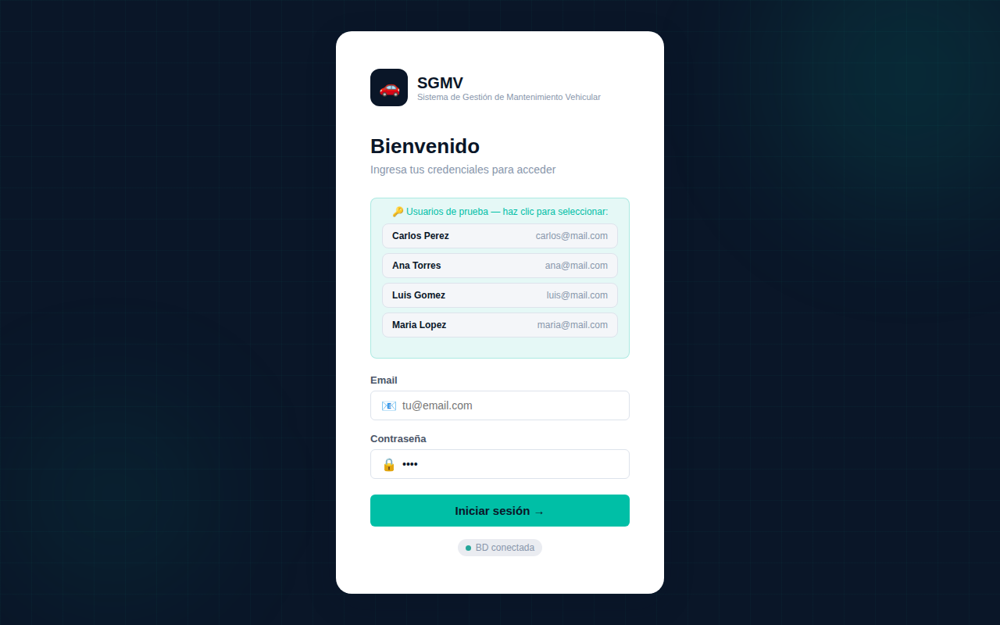

# 🚗 SGMV — Sistema de Gestión de Mantenimiento Vehicular

> Aplicación web para el registro, seguimiento y control del mantenimiento preventivo y correctivo de vehículos. Pensada para propietarios individuales, familias y pequeñas flotas.

---

## 📋 Descripción

**SGMV** es una aplicación frontend que centraliza toda la información de mantenimiento vehicular en un solo lugar. Permite registrar servicios, consultar historiales, y recibir alertas visuales tipo **semáforo** (🔴🟡🟢) antes de que un mantenimiento se venza.

### ¿Qué hace el sistema?

| Módulo | Funcionalidad |
|---|---|
| 🔐 Login | Autenticación con usuario y contraseña |
| 📊 Dashboard | Vista general con alertas activas y estado de la flota |
| 🚗 Vehículos | Registro, edición y eliminación de vehículos |
| 🔧 Mantenimientos | Formulario de registro de servicios realizados |
| 🔔 Alertas | Sistema semáforo de mantenimientos próximos o vencidos |
| 📋 Historial | Listado completo con filtros por vehículo, tipo y fecha |

### ¿Qué NO hace (en esta fase)?

- No integra con talleres, aseguradoras ni entidades gubernamentales
- No tiene módulo de análisis financiero avanzado
- No ofrece aplicación móvil nativa (es responsive web)
- No incluye inteligencia artificial ni automatización avanzada

---

## 🖼️ Capturas de pantalla

### Login

### Dashboard — Vista general


### Mis Vehículos


### Registrar Mantenimiento


### Alertas — Sistema semáforo


### Historial con filtros


---

## 🗂️ Estructura del proyecto

```
sgmv/
├── login.html                  # Pantalla de inicio de sesión
├── css/
│   └── styles.css              # Sistema de diseño y estilos globales
├── js/
│   └── nav.js                  # Componente de navegación compartido
└── pages/
    ├── dashboard.html          # Panel principal con resumen
    ├── vehiculos.html          # Gestión de vehículos
    ├── mantenimientos.html     # Registro de mantenimientos
    ├── alertas.html            # Sistema de alertas semáforo
    └── historial.html          # Historial completo con filtros
```

---

## ⚙️ Cómo correr el proyecto

### Opción 1 — Abrir directamente (sin servidor)

1. **Clona o descarga** el repositorio:

```bash
git clone https://github.com/tu-usuario/sgmv.git
cd sgmv
```

2. **Abre el archivo de entrada** en tu navegador:

```bash
# En Windows
start login.html

# En macOS
open login.html

# En Linux
xdg-open login.html
```

3. **Inicia sesión** con las credenciales de prueba:
   - Usuario: `admin`
   - Contraseña: `1234`

> ✅ **No requiere instalación de dependencias**. Es HTML/CSS/JS puro, funciona directamente en el navegador.

---

### Opción 2 — Con servidor local (recomendado para evitar errores CORS)

#### Usando Python

```bash
# Python 3
cd sgmv
python -m http.server 8080

# Luego abre en el navegador:
# http://localhost:8080/login.html
```

#### Usando Node.js con `serve`

```bash
# Instalar serve globalmente (solo una vez)
npm install -g serve

# Ejecutar en la carpeta del proyecto
cd sgmv
serve .

# Luego abre:
# http://localhost:3000/login.html
```

#### Usando VS Code — Live Server

1. Instala la extensión **Live Server** en VS Code
2. Abre el archivo `login.html`
3. Haz clic derecho → **Open with Live Server**
4. El navegador abrirá automáticamente `http://127.0.0.1:5500/login.html`

---

## 🧭 Navegación del sistema

```
login.html
    └── pages/dashboard.html      ← Inicio tras iniciar sesión
            ├── vehiculos.html    ← Gestión de vehículos
            ├── mantenimientos.html ← Registrar servicios
            ├── alertas.html      ← Alertas y semáforo
            └── historial.html    ← Historial completo
```

---

## 🛠️ Tecnologías utilizadas

| Tecnología | Uso |
|---|---|
| **HTML5** | Estructura de vistas y formularios |
| **CSS3** | Sistema de diseño, variables, animaciones |
| **JavaScript (ES6+)** | Lógica de UI, filtros, formularios, navegación |
| **Google Fonts** | Tipografías: Syne (display) + DM Sans (body) |

> **Sin frameworks, sin dependencias externas.** Todo funciona con tecnologías web estándar.

---

## 📐 Requerimientos funcionales implementados

| RF | Descripción | Vista |
|---|---|---|
| RF-001 | Registrar mantenimiento con tipo, fecha, km y costo | `mantenimientos.html` |
| RF-002 | Consultar historial con filtros | `historial.html` |
| RF-003 | Alertas semáforo verde/amarillo/rojo | `alertas.html` |
| RF-004 | Registrar/editar/eliminar vehículos | `vehiculos.html` |
| RF-005 | Autenticación con usuario y contraseña | `login.html` |

---

## 👥 Usuarios del sistema

| Rol | Acceso |
|---|---|
| **Administrador** | CRUD completo: vehículos, mantenimientos, alertas |
| **Usuario Familiar** | Solo consulta y registro de mantenimientos |

---


## 📐 Modelo Entidad Relacion- MER
Modelo Entidad - Relación (MER)

El sistema SGMV se diseñó con cinco entidades principales: Usuarios, Vehículos, Mantenimientos, Tipos de Mantenimiento y Alertas. Estas entidades permiten gestionar el control del mantenimiento vehicular y el historial de servicios.

Un usuario puede registrar uno o varios vehículos. Cada vehículo pertenece a un único usuario.
Cada vehículo puede tener múltiples mantenimientos asociados, los cuales registran los servicios realizados.
Los mantenimientos están clasificados por tipos de mantenimiento como cambio de aceite, frenos, llantas, entre otros.
Además, cada vehículo puede generar alertas para recordar futuros mantenimientos.

Relaciones del sistema:

Usuarios 1:N Vehículos
Vehículos 1:N Mantenimientos
Tipos_Mantenimiento 1:N Mantenimientos
Vehículos 1:N Alertas

Esto permite mantener la integridad de los datos y consultar el historial de mantenimiento de cada vehículo.


## 📐 Diccionario De Datos


# 🚗 SGMV — Sistema de Gestión de Mantenimiento Vehicular

> **Dirigido a:** Personal técnico que desee implementar o desplegar el sistema.

---

## 📐 Especificaciones Técnicas

### Stack tecnológico

| Capa | Tecnología | Versión mínima requerida |
|------|-----------|--------------------------|
| Backend | Python | **3.8+** |
| Framework web | Flask | **2.0+** |
| Base de datos (desarrollo) | SQLite | Incluido en Python stdlib |
| Base de datos (producción) | MySQL | **8.0+** |
| Frontend | HTML5 / CSS3 / JavaScript | ES6+ (Chrome 80+, Edge 80+) |

### Dependencias Python

```
flask==2.3.x  (o superior compatible)
```

Archivo `requirements.txt`:
```
flask>=2.0.0
```

Para MySQL en producción, agregar:
```
flask>=2.0.0
pymysql>=1.0.0
```

---

## ⚙️ Instalación y puesta en marcha

### Requisitos previos

- **Python 3.8 o superior** — https://www.python.org/downloads/
  - Marcar ✅ **"Add Python to PATH"** durante la instalación
- **pip** — incluido con Python 3.4+
- **Navegador:** Chrome 80+ o Edge 80+

### Verificar instalación de Python

```bash
python --version      # Debe mostrar Python 3.8+
pip --version         # Debe mostrar pip 20+
```

### Paso 1 — Descomprimir el proyecto

```
sgmv_app/
├── backend/
│   ├── app.py              ← Servidor API REST
│   └── sgmv_database.sql   ← Script SQL para MySQL
└── frontend/
    ├── index.html
    ├── dashboard.html
    ├── vehiculos.html
    ├── mantenimientos.html
    ├── alertas.html
    ├── historial.html
    ├── css/styles.css
    └── js/api.js
```

### Paso 2 — Instalar Flask

```bash
pip install flask
```

O usando el módulo Python directamente:

```bash
python -m pip install flask
```

### Paso 3 — Iniciar el servidor

```bash
cd sgmv_app/backend
python app.py
```

Salida esperada:
```
✅ BD inicializada
🚗 SGMV API corriendo en http://localhost:5000
 * Running on http://127.0.0.1:5000
```

### Paso 4 — Abrir la aplicación

```
http://localhost:5000
```

**La terminal/cmd debe permanecer abierta** mientras se usa la aplicación.

---

## 🗄️ Base de datos

### Modo desarrollo — SQLite (por defecto)

El archivo `sgmv.db` se crea automáticamente en `backend/` al primer arranque. Contiene los datos del SQL original ya cargados. No requiere configuración.

Para inspeccionar la BD en SQLite:
```bash
# Instalar SQLite browser: https://sqlitebrowser.org/
# O usar línea de comandos:
sqlite3 backend/sgmv.db
sqlite> SELECT * FROM vehiculos;
sqlite> .quit
```

### Modo producción — MySQL 8.0

**1.** Cargar el esquema:
```bash
mysql -u root -p < backend/sgmv_database.sql
```

**2.** Modificar `backend/app.py` — reemplazar la función `get_db()`:

```python
import pymysql

DB_CONFIG = {
    'host':     'localhost',
    'user':     'root',
    'password': 'tu_password',
    'database': 'sgmv',
    'cursorclass': pymysql.cursors.DictCursor
}

def get_db():
    return pymysql.connect(**DB_CONFIG)
```

**3.** Instalar el conector MySQL:
```bash
pip install pymysql
```

---

## 🔌 API REST — Referencia de endpoints

| Método | Endpoint | Descripción |
|--------|----------|-------------|
| `POST` | `/api/login` | Autenticar usuario |
| `GET` | `/api/usuarios` | Listar usuarios |
| `GET` | `/api/vehiculos` | Listar vehículos (opcional: `?id_usuario=N`) |
| `POST` | `/api/vehiculos` | Crear vehículo |
| `PUT` | `/api/vehiculos/:id` | Actualizar vehículo |
| `DELETE` | `/api/vehiculos/:id` | Eliminar vehículo |
| `GET` | `/api/mantenimientos` | Listar mantenimientos (opcional: `?id_vehiculo=N`) |
| `POST` | `/api/mantenimientos` | Crear mantenimiento |
| `PUT` | `/api/mantenimientos/:id` | Actualizar mantenimiento |
| `DELETE` | `/api/mantenimientos/:id` | Eliminar mantenimiento |
| `GET` | `/api/alertas` | Listar alertas |
| `POST` | `/api/alertas` | Crear alerta |
| `PUT` | `/api/alertas/:id` | Actualizar estado de alerta |
| `DELETE` | `/api/alertas/:id` | Eliminar alerta |
| `GET` | `/api/tipos` | Listar tipos de mantenimiento |
| `GET` | `/api/dashboard` | Estadísticas generales |

Todos los endpoints devuelven **JSON** y soportan **CORS**.

---

## 🔧 Configuración de puertos

Por defecto el servidor corre en el puerto **5000**. Para cambiarlo:

```python
# En app.py, última línea:
app.run(debug=True, port=8080)  # Cambiar 5000 por el puerto deseado
```

Y actualizar en `frontend/js/api.js`:
```javascript
const API_URL = 'http://localhost:8080/api'; // Actualizar puerto
```


## 📄 Licencia

Proyecto académico — Ingeniería de Software · 2025.

---

## 🤝 Autor

Diego Leon Reyes